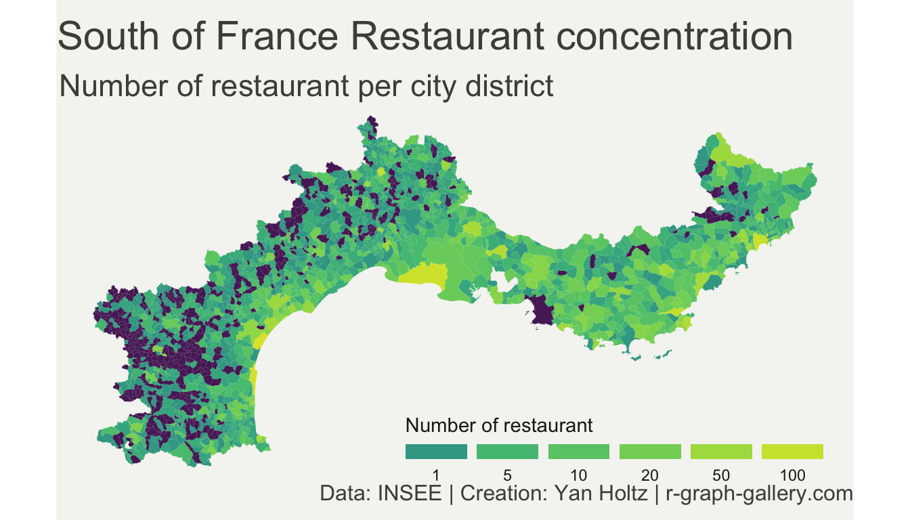
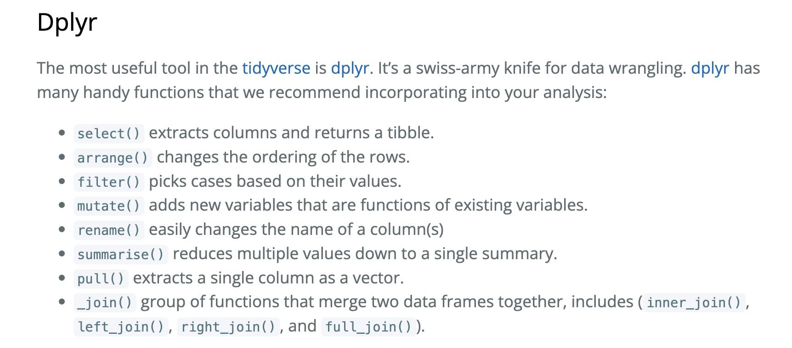

# Introduction 

## R/RStudio/RMarkdown and Why? 

+ R is a statistical programming language great for data analysis and data science applications 

+ RStudio is an Integrated Development Environment (IDE)--basically just a nice interface for using R, writing/running code, and interacting with data and files

+ RMarkdown is a file format that lets you combine R code, data, and text that outputs a document, report, slideshow, etc. 

## Cool things you can do with R 

+ Easy and intuitive management of code and data

+ Excellent visualization capabilities, including charts, maps, interactive dashboards etc. 

+ Easily output analysis into a digestible format

+ can handle a wide arrange of statistical analysis, data analysis, and data science applications 

## Some examples 


## Some examples 


## Some examples



## Some examples 


## Some examples


## Some examples 


# Goals 

## Today's workshop 

+ Learn the basics and fundamentals of working in RStudio and RMarkdown 

+ Learn a framework for reproducible analysis that can be applied to homework, work assignments, etc. 

+ Go through an analysis together to combine these 

+ Leave with a file that can serve as a template for future work 

## RStudio 


## R Scripts and R Markdown 

+ R Script (workshop-1.R)
   +  A file that only runs normal R code
   
+ RMarkdown Script (workshop-1.Rmd)
   + A different file type that combines code and text to produce a document that includes both 
   
+ Both a .R and .Rmd file are provided 


## Reproducible Analysis 


## Why you should care 

+ It will save you time and make analyses easy to update/run again 

+ Eliminates room for mistakes 

+ Easily shared and validated by others--especially crucial for analysis informing public policy

## What to keep in mind for our purposes 

+ The ideal: someone else (including and especially you, at a later date) should be able to

    (1) Read your code file and understand what you did and why (code comments are everyone's friend)
    (2) Re-run your code without making any edits and produce the same results 
    
    
+ In practice: 

    + Any data cleaning, transformations to the data, edits, analyses, etc. should be documented in an R script 
    + No edits should be made manually!!! (don't edit your data in excel, don't manually enter or copy/paste output, etc.)

## Tidyverse


:::: {.columns}
::: {.column width="60%"}

:::
::: {.column width="40%"}
+ A collection of R packages made for data/statistical analysis with the same underlying structure, intuitive syntax and philosophy

+ Great for working with and manipulating a wide variety of datasets 

+ We will use tidyverse today
:::
::::

## Tidyverse 


# Learn!

## What we will do today 

+ Go through and reproduce a shortened version of Project 2 from last semester's 507c class 

+ use tidyverse to:

  + read in data
  + clean/transform data 
  + generate summary statistics
  + run a regression model 
  + output results in a summary memo document

## Files 

+ workshop-1.R 

  + this is just an R script with all the code for your reference later 

+ workshop-1-skeleton.Rmd

  + an RMarkdown code skeleton for you to fill out as we go 

+ workshop-1-solutions.Rmd

  + the same RMarkdown code file as above, but with all the code and solutions 
  
## RMarkdown File Structure: Overview 


## RMarkdown File Structure: YAML  


## RMarkdown File Structure: Code 


## RMarkdown File Structure: Text

   

## Rmarkdown: Output 


## R Programming Basics 

\tiny
```{r, echo=T,eval=T}
# object assignment 
# (strings, numbers, dataframes, lists, etc.)
this_is_an_object <- "object"

# this is how you inspect an object 
this_is_an_object

# another assignment 
x <- 2^3 

# another inspection 
x

```

+ Naming is case sensitive 

+ Must start with a letter and have no spaces 

+ i_suggest_using_this_format

+ ButSomePeopleDoThis 

+ objects will be loaded into your environment on the right!

## Set Up: Working Directory, Package Loading

```{r, echo=T, eval=F, message=F,warning=F}

#set working directory
setwd("~/Documents/workshop-1")

# you will only need to install packages once 
install.packages("tidyverse")
install.packages("kableExtra")
install.packages("stargazer")
install.packages("knitr")
install.packages("rdrobust")

# you will do this whenever 
# you need to load in and use tidyverse
library(tidyverse)
library(kableExtra)
library(stargazer)
library(knitr)
library(rdrobust)
```

```{r, echo=F,eval=T,warning=F,message=F}
library(tidyverse)
```


## Read in and inspect our data 

\tiny

```{r echo=T, eval=T, message=F,warning=F}
mlda <- read_csv("mlda.csv")
mlda
```


+ Use the viewer to view more of the data (click on it or run code below)


```{r echo=T, eval=F, message=F,warning=F}
View(mlda)
```

## Some quick data exploration 

```{r}
mean(mlda$student)
mean(mlda$drinks_alcohol)

```


## Transform, explore, and visualize 



## Tidyverse Function Syntax 

```{r, echo=F,warning=F,message=F}
library(kableExtra)
df <- data.frame(Function = c("select()", "mutate()", "filter()", "rename()", "summarise()", "if_else"), 
                 Syntax = c("select(df, var1, var2, ...)", "mutate(df, new_var = old_var + 5)", "filter(df, var1 == value)", "rename(df, new_name = old_name)", 
                            "summarise(df, mean_var1 = mean(var1))", "if_else(condition, true, false)"))
kable(df, format = 'latex', booktabs=T, caption = "Useful dplyr functions and syntax") %>% 
 kable_styling(latex_options = "striped")
```


## Transform and explore
\tiny
```{r}
# add a new variable for age in years and a heavy drinker variable if they drink more than 50% 
mlda <- mutate(mlda, age_years = 21 + days_21/365, heavy_drinker = if_else(perc_days_drink > 75, 1, 0))

# filter to just underage drinkers 
underage <- filter(mlda, days_21 < 0 & drinks_alcohol == 1)

# demographic characteristics of underage drinkers 
summ_stats_underage <- summarise(underage, 
          min_age = min(age_years),
          mean_age = mean(age_years), 
          median_age = median(age_years),
          mean_perc_days_drink = mean(perc_days_drink), 
          median_perc_days_drink = median(perc_days_drink))

summ_stats_underage

```


## Use the pipe operator to combine all of these into one 'dplyr chain'

+ The pipe operate `%>%` takes output from on function and 'pipes' it into another function 

\tiny
```{r, eval=F}
x <- paste("A", "String")
print(x)

print(paste("A", "String"))

paste("A", "String") %>% 
  print(.)
```

+ The period denotes where the previous output should be the argument in the new function


```{r}
summ_stats <- mutate(mlda, age_years = 21 + days_21/365, heavy_drinker = if_else(perc_days_drink > 75, 1, 0)) %>% 
  filter(., days_21 < 0 & drinks_alcohol == 1) %>%  
  summarise(.,min_age = min(age_years),
          mean_age = mean(age_years), 
          median_age = median(age_years),
          mean_perc_days_drink = mean(perc_days_drink), 
          median_perc_days_drink = median(perc_days_drink)) 

summ_stats

# now let's look at summary stats of heavy drinkers vs non heavy drinkers: 

# demographic characteristics of heavy drinkers vs non-heavy drinkers
summ_stats_heavy <- mlda %>% 
  filter(drinks_alcohol ==1) %>%
  group_by(., heavy_drinker) %>%
  summarise(., min_age = min(age_years),
          mean_age = mean(age_years), 
          median_age = median(age_years),
          mean_student = mean(student),
          n = n())
summ_stats_heavy
```

## Try yourself 

+ Create a variable that denotes someone as an underage drinker (they are less than 21 years old and drink alcohol)
+ Use the skeleton code below to calculate the share of underage drinkers that are a student, married, male, Hispanic, Black, or white

```{r, eval=F}
summ_stats2 <- mutate(mlda, underage_drinker = if_else()) %>%
  filter() %>%  
  summarise() 
```


## Export as a table 
\tiny
```{r, eval=T,echo=T, warning=F,message=F}
library(kableExtra)

kableExtra::kable(summ_stats_underage,
      digits=1, caption="Drinking Patterns among Underage Drinkers", 
      col.names = c("Minimum Age", "Mean Age", "Median Age", "Avg Percent Days Drank", 
                    "Median Percent Days Drank")) 
```


## Age distribution of drinkers vs non-drinkers?
\tiny
```{r, fig.height=2.6,fig.width=4}
viz <- mlda %>% 
  mutate(drinks_alcohol_string = if_else(drinks_alcohol == 1, "Drinks", "Does Not Drink")) %>%
  ggplot(aes(x=drinks_alcohol_string, y=age_years)) +
  geom_boxplot()
viz
  
```


## Run a Model 

+ Use a linear probability model to predict the effect of age in years on the likelihood of drinking alcohol 
+ we can use lm()

\tiny
```{r, echo=T,eval=F}
# general form
lpm1 <- lm(formula = y ~ x_1 + x_2 + ... x_n, data = df)
```

\tiny
```{r}
# lpm of years in age on likelihood of drinking alcohol
lpm1 <- lm(formula = drinks_alcohol ~ age_years, data = mlda )
summary(lpm1)
```

## Exercise 
\tiny

+ Now, add an age squared and age cubed variable to your dataset and rerun


```{r,eval=F,echo=T}
mlda <- mlda %>% 
  mutate() 

lpm2 <- lm(formula = , data = )
```


+ Then add additional demographic controls to your model and rerun


```{r,eval=F,echo=T}

lpm3 <- lm(formula = drinks_alcohol ~ , data =)

```


```{r,eval=T,echo=F}
mlda <- mlda %>% 
  mutate(age_sq = age_years^2, age_cu = age_years^3) 

lpm2 <- lm(formula = drinks_alcohol ~ age_years + age_sq + age_cu, data = mlda)
```


```{r,eval=T,echo=F}

lpm3 <- lm(formula = drinks_alcohol ~ age_years + age_sq + age_cu + student + male, data=mlda)
```


## Use Stargazer to output your results 

\tiny

```{r, echo=T,eval=F,message=F,warning=F,results='asis'}
library(stargazer)

stargazer(lpm1, lpm2, type = "html", 
          dep.var.labels = "Probabilty of Drinking", header=F)
```

```{r, echo=F,eval=T,message=F,warning=F,results='asis'}
library(stargazer)

stargazer(lpm1, lpm2, 
          type = "latex", 
          dep.var.labels = "Probabilty of Drinking", 
          header=F)
```

## Output model results 

\tiny
```{r, echo=F,eval=T,message=F,warning=F,results='asis'}
library(stargazer)
stargazer(lpm1, lpm2, lpm3, type = "latex", dep.var.labels = "Probabilty of Drinking with Controls", header=F)
```

## Visualize the discontinuity 

\tiny

```{r, warning=F,message=F, fig.height=2.6,fig.width=4}
library(rdrobust)
rdplot(mlda$drinks_alcohol,mlda$age_years,c=21)
```

# Citations 

Russo, Francesco & Righelli, Dario & Angelini, Claudia. (2016). Advantages and Limits in the Adoption of Reproducible Research and R-Tools for the Analysis of Omic Data. Lecture Notes in Computer Science. 9874. 245-258. 10.1007/978-3-319-44332-4_19. 


