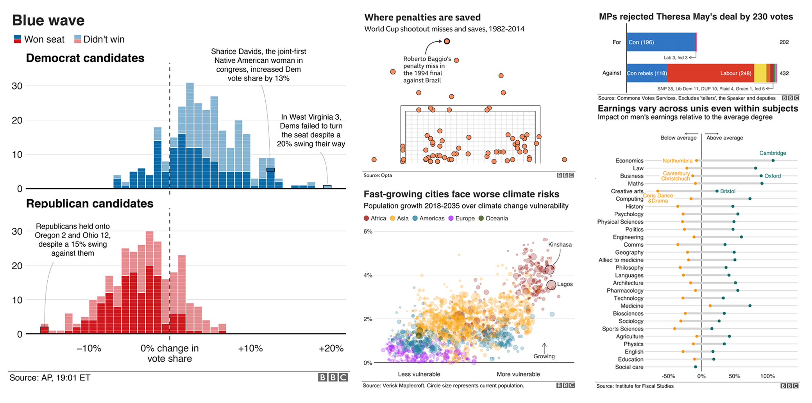
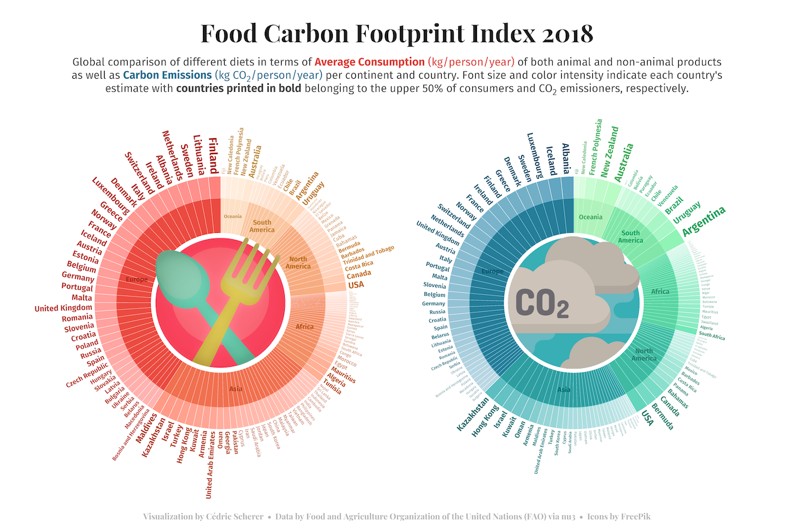
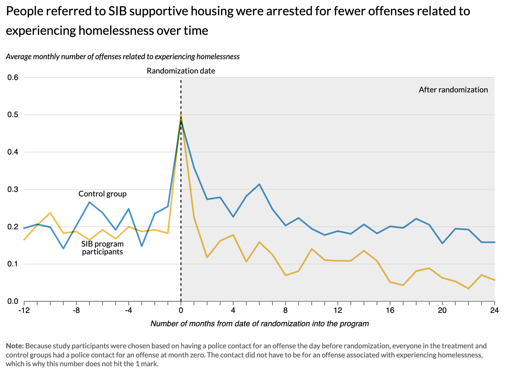
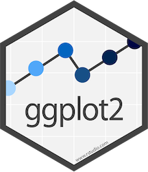
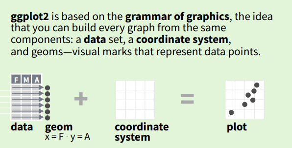
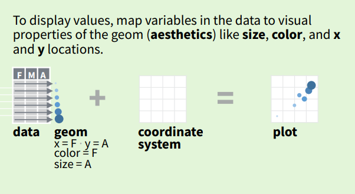
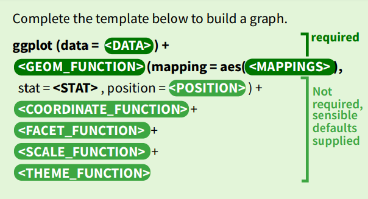
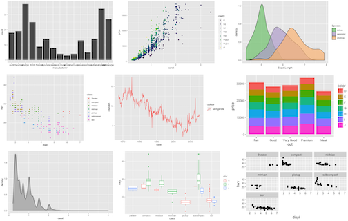
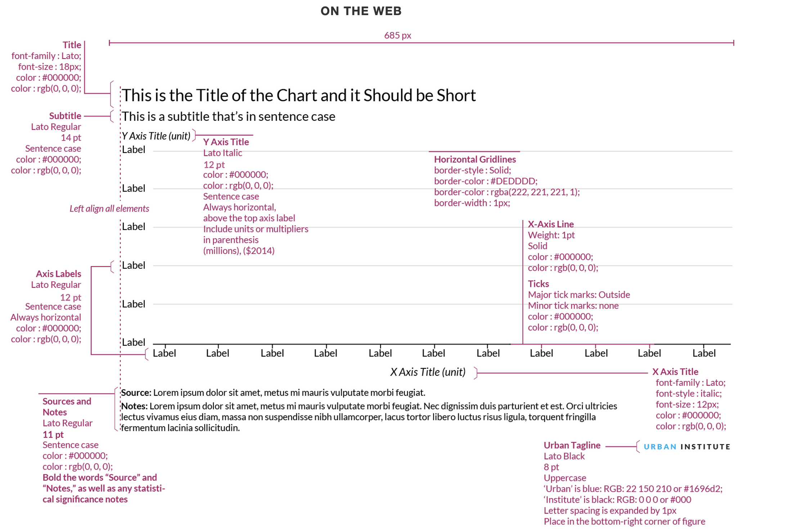

```{r setup, include=FALSE}
knitr::opts_chunk$set(echo = TRUE)
```


## tigeRs: workshop 2!

- (re)-introductions
- Thanks to DDSS for sponsoring lunch!
- Sticky notes for communication during exercises
- Live coding with me

## Motivation



## Motivation


## Motivation



## Motivation



## Goals

1. Get a taste of the logic behind the **grammar of graphics** (**gg**plot2)
2. Learn some good-enough figure design practices
3. Tell you about my favorite high-quality - and open-source! - learning resources

# The Grammar of Graphics

---

## The Grammar of Graphics

`ggplot2` is a system for declaratively creating graphics, based on "The Grammar of Graphics" (Wilkinson, 2005).

You provide the data, tell `ggplot2` how to **map variables to aesthetics,** what graphical features to use, and it takes care of the details.

{width=30%}

## The Grammar of Graphics



## The Grammar of Graphics



## The Grammar of Graphics




## Advantages of {ggplot2}

::: incremental
-   consistent underlying "grammar of graphics" (Wilkinson 2005)\
-   very flexible, layered plot specification\
-   theme system for polishing plot appearance\
-   lots of additional functionality thanks to extensions\
-   active and helpful community
:::

------------------------------------------------------------------------

{fig-align="center" fig-alt="A collection of the versatility of ggplot2 to create basic graphs. All of them use the default grey ggplot2 theme."}

## The ggplot2 Package

... is an **R package to visualize data** created by Hadley Wickham in 2005

```{r warning=F, message=F}
# install.packages("ggplot2")
library(ggplot2)
```

... is part of the [`{tidyverse}`](https://www.tidyverse.org/)

```{r warning=F, message=F}
# install.packages("tidyverse")
library(tidyverse)
```


# Let's jump in with examples! <ggplot-exercises.Rmd>

# Good Enough Figure Design

## Why "Good Enough"? 

- Depends on if visualization is exploratory or for presentation
- Not everyone is a data viz specialist
- But some practices are low-hanging fruit

---

](img/ah_ggplot2_exploratory.png){width=90%}

---


## Angela's Top Figure Design Tips

::: incremental
1. Make your figure labels **larger**.
1. Include a descriptive title/subtitle with your main finding to **tell the story**. (Bonus: this sometimes allows you to remove obvious axis labels.)
1. Reduce unnecessary "ink" to highlight the "data" in your graph (**data-ink ratio**)
1. **Draw out the graph** you want to make before jumping into R.
1. When in doubt, **look at existing models** for best practices (I love [Urban Institute's style guide](https://urbaninstitute.github.io/graphics-styleguide/) for policy communication, and PNAS academic journal articles tend to have nice visualizations in R).
1. If you can't make the figure work in ggplot2, you might need to **reshape the data** into long format
1. There's **probably an R package** that can make that {insert visualization here}.
:::

## OK Figure ("Ugly")

```{r eval=F}
ggplot(mtcars) +
  geom_point(aes(x = disp, y = mpg)) +
  labs(x = "Engine Size of Car", 
       y = "Fuel Economy (Miles Per Gallon)")
```

## OK Figure ("Ugly")

```{r echo=F}
ggplot(mtcars) +
  geom_point(aes(x = disp, y = mpg)) +
  labs(x = "Engine Size of Car", 
       y = "Fuel Economy (Miles Per Gallon)")
```

## Better Figure

```{r eval=F}
ggplot(mtcars) +
  geom_point(aes(x = disp, y = mpg)) +
  labs(x = "Engine Size", 
       y = "",
       title = "Fuel Economy and Engine Size",
       subtitle = "As engine size of a car increases, the miles per gallon decrease",
       caption = "Source: 1974 Motor Trends magazine (mtcars)") +
  theme_bw() +
  theme(text = element_text(size = 20))      
```
- See Wilke, [Fundamentals of Data Visualization, Parts II and III](https://clauswilke.com/dataviz/proportional-ink.html) for more tips. 


## Better Figure

```{r echo=F}
ggplot(mtcars) +
  geom_point(aes(x = disp, y = mpg), size = 3) +
  labs(x = "Engine Size", 
       y = "",
       title = "Fuel Economy and Engine Size",
       subtitle = "As engine size of a car increases, the miles per gallon decrease",
       caption = "Source: 1974 Motor Trends magazine (mtcars)") +
  theme_bw() +
  theme(text = element_text(size = 20))            
```

## Better Figure Inspiration



- From [Urban Institute Graphics Style Guide](https://urbaninstitute.github.io/graphics-styleguide/)

# Learning Resources

## Open by Default

R is an **open-source** programming language. This means source code is public and can be remixed. Learning resources often are too. So...

::: incremental
- There's a very, very strong culture around **open-by-default** resources (with Creative Commons licenses, Github code posting, etc.)
- The R community cares a lot about **helping folks learn** the language
- Many R users work in **collaborative** settings in academia, industry, and more.
:::

## My Favorite Open-Source Resources

Tutorials:

- [**Posit Cloud Primers**](https://posit.cloud/learn/primers/3): Interactive online tutorials to learn data viz in R, from the makers of RStudio
- [**Data Visualization course by Andrew Heiss**](https://datavizs21.classes.andrewheiss.com/): Designed as an entire course in R for policy school students

Cookbooks:

- [**R Graphics Cookbook, 2nd edition**](https://r-graphics.org/): Gives you recipes for creating various graphs in R - https://r-graphics.org/
- [**R Graph Gallery**](https://r-graph-gallery.com/index.html): Similarly, sorts R recipes by type of graph

## My Favorite Open-Source Resources

Whole Open-Source Books:

- [**ggplot2 book**](https://ggplot2-book.org/): Nitty gritty on how ggplot2 all works, from the creator of ggplot2
- [**Fundamentals of Data Visualization**](https://clauswilke.com/dataviz/): Less specific to ggplot2, more on best practices to learn data viz
- [**Data Visualization: A Practical Introduction**](https://socviz.co/): Online book by Soc Prof Kieran Healy walking you through exercises in R

Community:

- [**Tidy Tuesday R Community**](https://www.tidytuesday.com/): A community of folks learning R!
- **#rstats** Twitter: Search this hashtag to find all the R folks online.
- **tigeRs**: Keep coming to our workshops!

# **Takeaway: The best R resources are free, because the R community is awesome.**

## Thanks!

- Remixed slides and materials from:
  - [Cedric Scherer's Graphic Design with ggplot2](https://rstudio-conf-2022.github.io/ggplot2-graphic-design/)
  - [Introduction to R for Geospatial Data](https://datacarpentry.org/r-intro-geospatial/)
  - [Emily Burchfield Courses](https://www.emilyburchfield.org/courses/)
- This work is licensed under CC BY NC ND 4.0 as well, and on [Github](https://github.com/kimberlykreiss/r-for-public-policy).

- Next tigeRs meeting: Lightning Talks after Spring Break!

